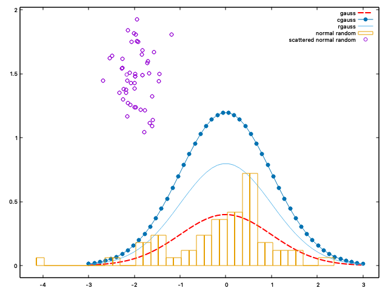

# Cplot

Was pretty disatisfied with the existing C gnuplot wrapper, wrote this one quickly to plot some things for a project.

In particular it doesn't create trash files with the gnuplot commands.

To use :

```c
#include "plot.h"

// to access some useful functions
#include "num.h"
```

```c
int dimr = 50;

double * xr = linspace(-3, 3, dimr);
double * yr = apply_func(xr, dimr, normal_cr);

gnuplot * plt = instanciatePlot();

plot(plt, xr, yr, dimr, "title 'gauss' dt 2 lc 'red' lw 2");

free(xr);
free(yr);
```

There are more usecases in main.c


